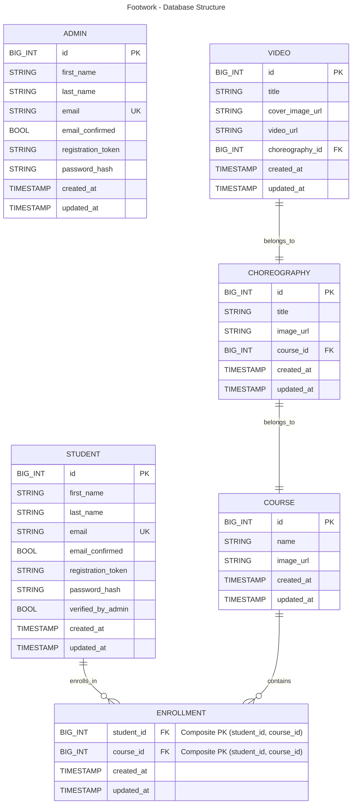

# Footwork - Backend
Footwork is a dance video management system for dance schools and associations.
<br/>

[Check the front-end](https://github.com/gianlucaromeo/footwork-frontend/tree/main)
<br/>

## Tech Stack


## Database structure


## Project structure
```
├── app.js
├── index.js
│
├── ... configuration files
│
├── controllers
│   ├── admins.js
│   ├── choreographies.js
│   ├── login.js
│   ├── ...
│
├── db
│   └── db.js
│
├── models
│   ├── admin.js
│   ├── choreography.js
│   ├── ...
│
├── tests
│   ├── admins.test.js
│   ├── choreographies.test.js
│   ├── helper.js
│   ├── ...
│
└── utils
    ├── config.js
    ├── emailSender.js
    ├── logger.js
    ├── middleware.js
    └── s3Upload.js
```

## Notes
More details and images will be uploaded before 29 November! 👀
