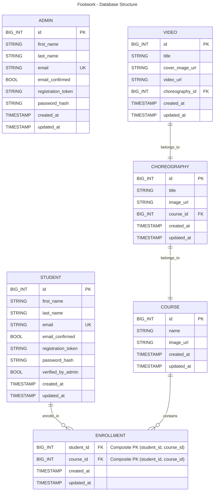

# Footwork - Backend
Footwork is a dance video management system aimed at helping dance schools and associations organize their video content and student enrollments. This repository contains the backend code, built with Node.js and Express.
<br/>

[Check the front-end](https://github.com/gianlucaromeo/footwork-frontend/tree/main)
<br/>

## Tech Stack

- Runtime: Node.js
- Framework: Express.js
- Database: MySQL (via Sequelize ORM), AWS RDS
- Storage: AWS S3 (for videos and images)
- Authentication: JSON Web Tokens (JWT) and bcrypt
- Linting: eslint
- Environment Management: dotenv
- Documentation: .md and mermaid
<br/>


## Key Features

### General
- RESTful API to manage users, courses, choreographies, and videos.
- Role-based access control (Admin vs. Student).
- JWT-based authentication and secure password hashing (bcrypt).

### For Students
- Registration and account management.
- Access only to enrolled courses and their videos.

### For Teachers (Admins)
- Manage students, courses, and videos.
- Upload dance videos and organize content by choreographies.

## Deployment
The backend is deployed on Render, and the production database is hosted on AWS RDS.

## Known Issues
- Delayed initial response: Due to Render's free plan, the backend instance may take up to 50 seconds to respond after inactivity.
- Limited scalability: Video uploads rely on AWS S3, but optimization for large-scale usage is not yet implemented.

## Database structure


## Project structure
```
├── app.js
├── index.js
│
├── ... configuration files
│
├── controllers
│   ├── admins.js
│   ├── choreographies.js
│   ├── login.js
│   ├── ...
│
├── db
│   └── db.js
│
├── models
│   ├── admin.js
│   ├── choreography.js
│   ├── ...
│
├── tests
│   ├── admins.test.js
│   ├── choreographies.test.js
│   ├── helper.js
│   ├── ...
│
└── utils
    ├── config.js
    ├── emailSender.js
    ├── logger.js
    ├── middleware.js
    └── s3Upload.js
```

## License
This project is licensed under the MIT License.
