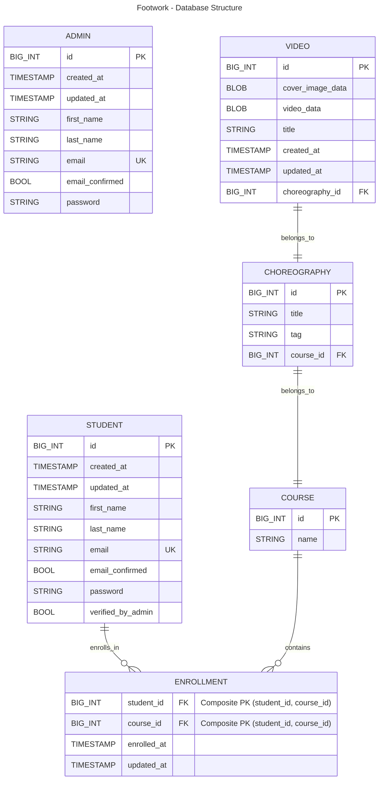

# footwork-backend
Backend of Footwork: a dance video management system for dance schools and association.

## Database structure - draft
Creted with mermaid. Note: composite keys are not available in mermaid syntax yet.

